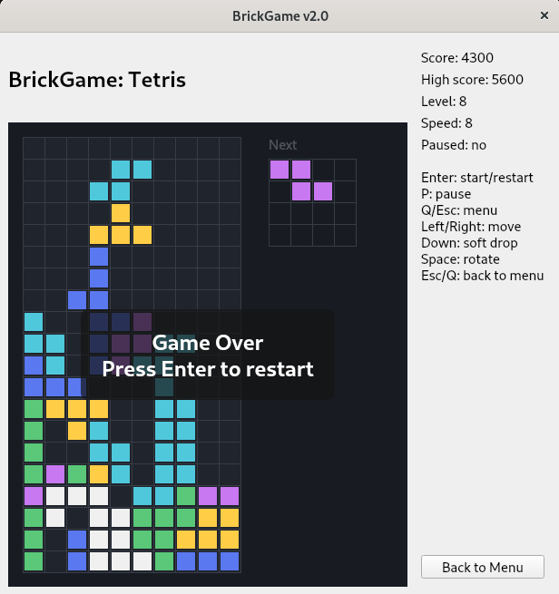
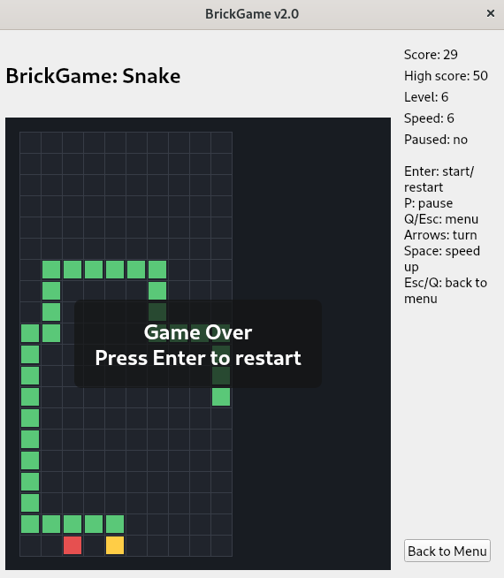

# BrickGame v2.0

Snake and Tetris collection with a shared `ncurses` CLI and a Qt6 desktop UI.




This repository contains:

- a C++17 Snake game library in `src/brick_game/snake`
- the BrickGame v1.0 Tetris library preserved in C in `src/brick_game/tetris`
- a shared terminal interface in `src/gui/cli`
- a shared Qt desktop interface in `src/gui/desktop`
- unit tests for the Snake library using GTest

## Features

- common startup menu in both CLI and desktop apps
- one desktop binary supporting both Tetris and Snake
- finite-state-machine driven game logic
- MVC-style separation between game logic, adapters/controllers, and views
- Snake automatic movement, pause, win, and game-over states
- Snake scoring and persistent high score
- Snake level progression every 5 points, up to level 10
- Tetris support in both CLI and desktop UI

## Project Structure

```text
src/brick_game/common  - shared BrickGame types
src/brick_game/snake   - Snake game logic in C++17
src/brick_game/tetris  - Tetris game logic imported from v1.0
src/controller         - shared adapters and application controller
src/gui/cli            - terminal UI based on ncurses
src/gui/desktop        - desktop UI based on Qt6 Widgets
tests/                 - GTest unit tests for Snake
docs/                  - FSM documentation and screenshots
```

## Build

Build both applications:

```bash
make all
```

Outputs:

- CLI: `./build/brick_game_cli`
- Desktop: `./build/desktop/brick_game_desktop`

## Run

Run the CLI version:

```bash
./build/brick_game_cli
```

Run the desktop version:

```bash
./build/desktop/brick_game_desktop
```

Install both binaries locally:

```bash
make install
~/.local/bin/brick_game_cli
~/.local/bin/brick_game_desktop
```

## Controls

Shared menu:

- `Up/Down` or desktop menu buttons: select game
- `Enter`: open selected game
- `Q` or `Esc`: quit from the main menu

In-game:

- `Enter`: start or restart
- `P`: pause / resume
- `Q` or `Esc`: return to the main menu

Tetris:

- `Left/Right`: move piece
- `Down`: soft drop
- `Space`: rotate piece

Snake:

- `Arrows`: change snake direction
- `Space`: temporary speed-up

## Snake Mechanics

- field size `10x20`
- initial snake length `4`
- automatic forward movement based on a timer
- apple eating increases snake length by `1`
- score increases by `1` for each apple
- persistent high score stored at `~/.local/share/brick_game_snake/high_score`
- level increases every `5` points up to `10`
- higher levels increase movement speed
- win on length `200`
- lose on wall collision or self collision

## Tests

Run unit tests:

```bash
make tests
```

Current tests cover Snake FSM and gameplay behavior, including:

- state transitions
- pause/resume behavior
- movement timing
- direction changes and reverse-turn rejection
- collisions and win state
- score and high-score persistence
- level progression and speed scaling

## Coverage

Generate a coverage report for the Snake library:

```bash
make gcov_report
```

If `lcov` and `genhtml` are installed, an HTML report is generated at:

```text
report/html/index.html
```

Otherwise, the target falls back to `gcov` text output in:

```text
report/coverage.txt
```

## Make Targets

- `make all` - build CLI and desktop binaries
- `make install` - install binaries to `~/.local/bin` by default
- `make uninstall` - remove installed binaries
- `make clean` - remove build, distribution, and coverage artifacts
- `make dvi` - print documentation entry points
- `make dist` - create a source archive
- `make tests` - run Snake unit tests
- `make gcov_report` - generate Snake coverage output

To install somewhere else, override `PREFIX`:

```bash
make install PREFIX=/usr/local
```

## FSM Docs

- `docs/tetris_fsm.md`
- `docs/snake_fsm.md`

## Notes

- The CLI is intended for a normal terminal window with `ncurses` support.
- The desktop UI requires Qt6 development/runtime packages.
- Snake tests and coverage require GTest development files.
